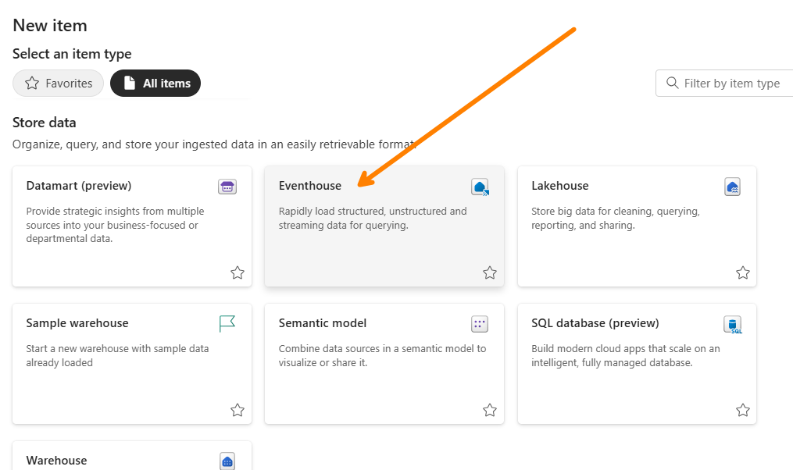
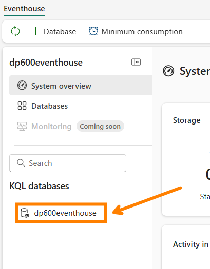
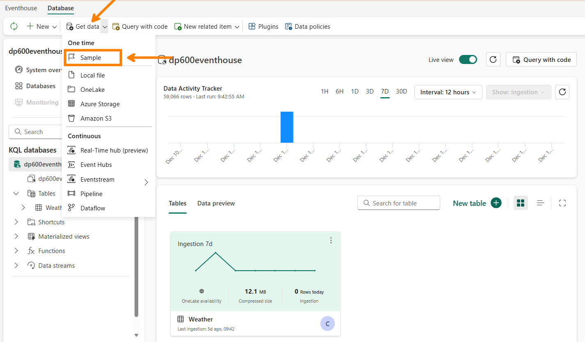
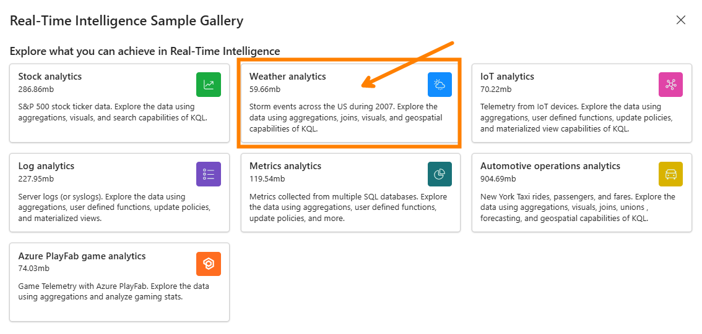
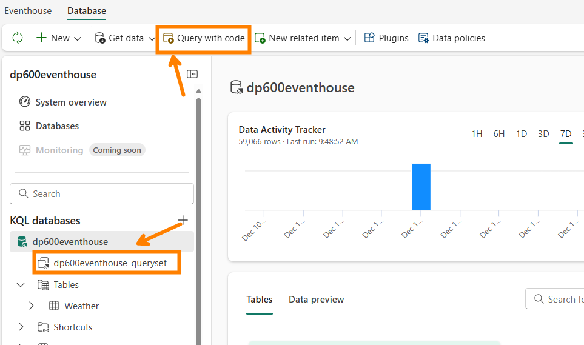
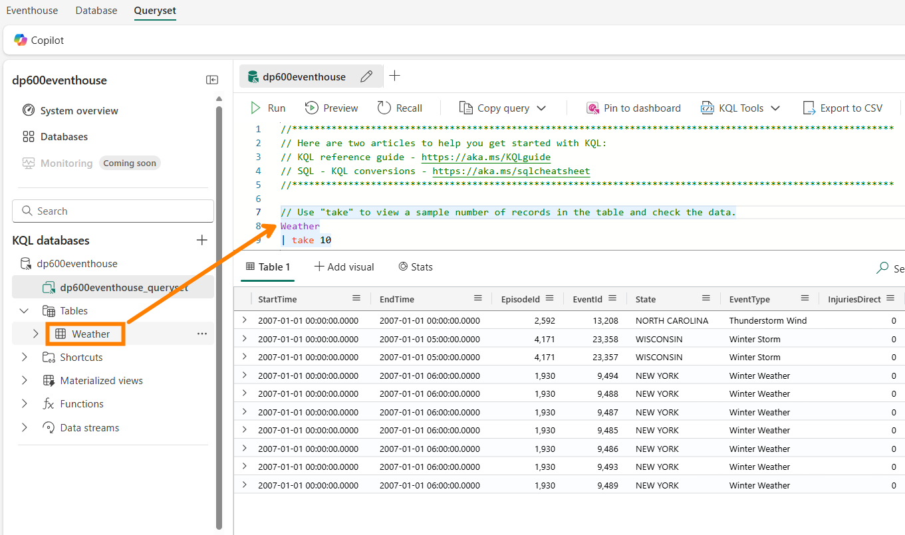
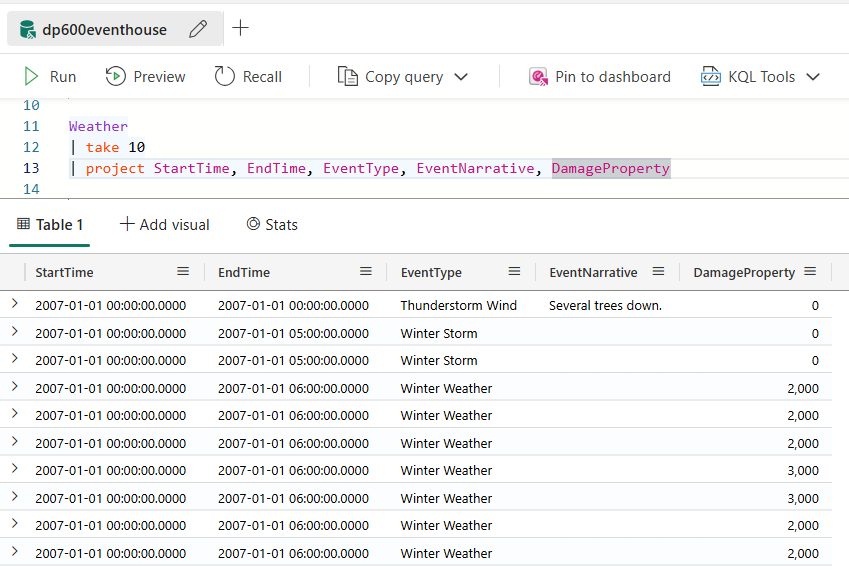
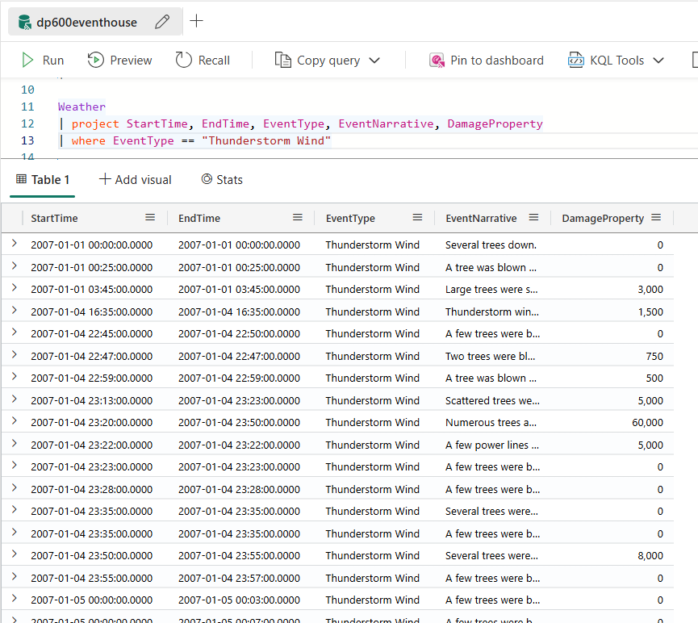
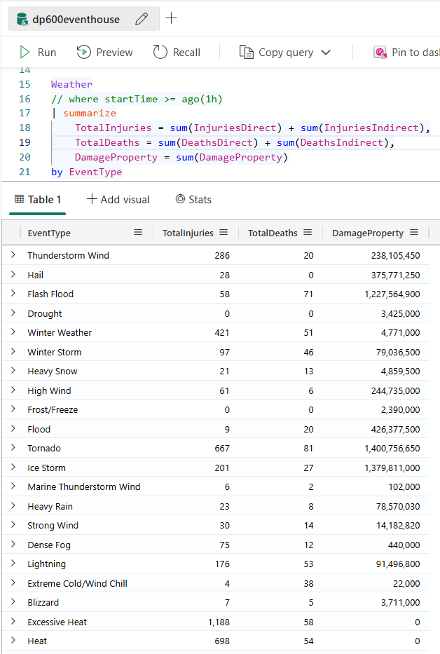
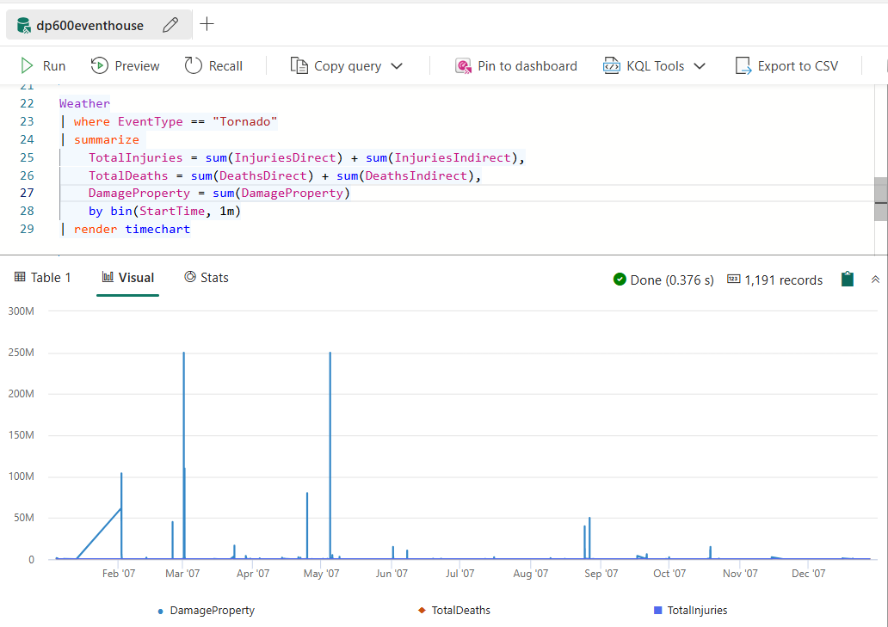

# Get started with Real-Time Intelligence in Microsoft Fabric

In this module, you'll dive into Fabric Real-Time Intelligence and explore cool stuff like the Eventhouse (KQL databases), Querysets, and how to query with KQL.


For this demo, we will be using some sample data to demo how to use the KQL Querysets to query streaming data.

## Use KQL to query streaming data

1. Create an eventhouse in your workspace.

    

2. Once created, navigate to the default KQL database created inside the eventhouse.

    

3. Add some sample data to the KQL database, which we will later be querying.

    

    I'll be adding the Weather analytics data in this demo because it's the smallest sample and takes less than 2 minutes to ingest into your KQL Database. You can choose any one of these if you plan on prepping the demo in advance.

    

4. To query the data, you can either click on "Query with code" or go straight to the queryset.

    

5. In the queryset, you can query the sample data we just added to the KQL database. Here's a very simple KQL query.

    ```kql
    Weather
    | take 10
    ```

    which equates to this SQL query,

    ```sql
    SELECT *
    FROM Weather
    LIMIT 10
    ```

    When writing a KQL Query, we always kick things off with the table name and then add the other predicates.

    

6. To select a few attributes, you can use the project predicate.

    ```kql
    Weather
    | take 10
    | project StartTime, EndTime, EventType, State, EventNarrative, DamageProperty
    ```

    

7. To filter the table, you can use the where predicate.

    ```kql
    // To get the data from the last hour
    
    Weather
    | where StartTime >= ago(1h)
    ```

    ```kql
    // Filter the Thunderstorm Wind events

    Weather
    | project StartTime, EndTime, EventType, State, EventNarrative, DamageProperty
    | where EventType == "Thunderstorm Wind"
    ```

    

8. And don't forget to check out the grouping predicate! It looks quite different from its SQL equivalent.

    ```kql
    // Group by EventType and Aggregate different metrics

    Weather
    | summarize
        TotalInjuries = sum(InjuriesDirect) + sum(InjuriesIndirect),
        TotalDeaths = sum(DeathsDirect) + sum(DeathsIndirect),
        DamageProperty = sum(DamageProperty)
    by EventType
    ```

    

9. Finally, we can also render the data as a visualization.

    ```kql
    Weather
    | where EventType == "Tornado"
    | summarize 
        TotalInjuries = sum(InjuriesDirect) + sum(InjuriesIndirect),
        TotalDeaths = sum(DeathsDirect) + sum(DeathsIndirect),
        DamageProperty = sum(DamageProperty)
        by bin(StartTime, 1m)
    | render timechart
    ```

    

